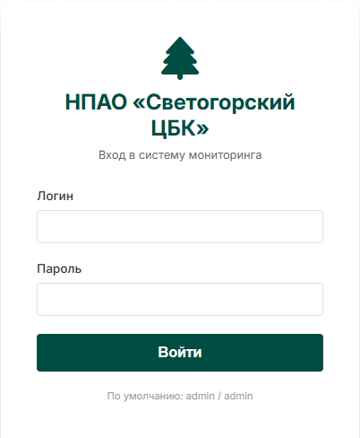
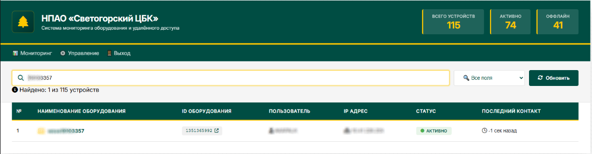
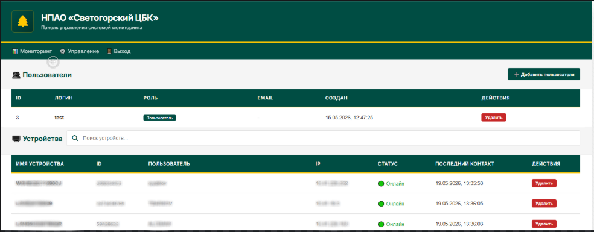

# RustDesk Monitor

[](https://github.com/fiverok/sveApiRust/releases)
[](https://www.docker.com/)
[](https://www.python.org/)
[](LICENSE)

Система мониторинга компьютеров для RustDesk с веб-интерфейсом, авторизацией и панелью администратора.

## 📋 Оглавление

- [Возможности](#-возможности)
- [Скриншоты](#-скриншоты)
- [Быстрый старт](#-быстрый-старт)
- [API Endpoints](#-api-endpoints)
- [Структура проекта](#-структура-проекта)
- [Конфигурация](#-конфигурация)
- [Развертывание](#-развертывание)
- [Управление пользователями](#-управление-пользователями)
- [Логирование](#-логирование)
- [Устранение неполадок](#-устранение-неполадок)
- [Разработка](#-разработка)
- [Лицензия](#-лицензия)

## 🚀 Возможности

### Основные функции
- **Мониторинг устройств** в реальном времени
- **Автоматическая регистрация** клиентов RustDesk
- **Online/Offline статус** с автоматическим обновлением
- **Поиск и фильтрация** устройств
- **Копирование имени** устройства в буфер обмена
- **Подключение через RustDesk** по клику на ID

### Администрирование
- **Управление пользователями** (создание/удаление)
- **Ролевая модель** (администратор/пользователь)
- **Удаление устройств** из системы
- **Лог аудита** всех действий
- **Статистика** онлайн/оффлайн устройств

### Технические особенности
- **SQLite** для надежного хранения данных
- **Docker** контейнеризация
- **Безопасное хеширование** паролей (PBKDF2)
- **Детальное логирование** sysinfo и heartbeat
- **Корпоративный дизайн** (зеленый #004D43, желтый #FFC700)

## 📸 Скриншоты
### Страница входа


### Мониторинг устройств


### Панель администратора


## 🚀 Быстрый старт

### Предварительные требования
- Docker 20.10+
- Docker Compose 2.0+
- Git

### Установка

```bash
# Клонирование репозитория
git clone https://github.com/fiverok/sveApiRust.git
cd sveApiRust

# Запуск в Docker
docker-compose up -d

# Проверка работы
curl http://localhost:21114/health
```

### Первый вход

| Параметр | Значение |
|----------|----------|
| URL | `http://your-server:21114` |
| Логин | `admin` |
| Пароль | `admin` |

## 📡 API Endpoints

### Публичные API (для клиентов RustDesk)

| Endpoint | Метод | Описание | Ответ |
|----------|-------|----------|-------|
| `/api/sysinfo` | POST | Регистрация устройства | `SYSINFO_UPDATED` |
| `/api/heartbeat` | POST | Обновление статуса | `{"modified_at": timestamp}` |
| `/api/version` | GET | Версия API | `2.0.0` |
| `/api/sysinfo_ver` | POST | Версия сервера | `2025.1.0` |
| `/health` | GET | Проверка здоровья | `{"status": "healthy"}` |

### API Аутентификации

| Endpoint | Метод | Описание | Требует auth |
|----------|-------|----------|--------------|
| `/api/login` | POST | Вход в систему | Нет |
| `/api/users/me` | GET | Текущий пользователь | Да |
| `/api/users` | GET | Список пользователей | Admin |
| `/api/users` | POST | Создать пользователя | Admin |
| `/api/users/{id}` | DELETE | Удалить пользователя | Admin |

### API Управления

| Endpoint | Метод | Описание | Требует auth |
|----------|-------|----------|--------------|
| `/api/computers` | GET | Список устройств | Да |
| `/api/computers/{uuid}` | DELETE | Удалить устройство | Admin |
| `/api/stats` | GET | Статистика | Да |
| `/api/audit` | GET | Лог аудита | Admin |

## 📁 Структура проекта

```
rustdesk-monitor/
├── static/                 # Статические файлы
│   ├── style.css          # Общие стили
│   ├── login.html         # Страница входа
│   ├── index.html         # Страница мониторинга
│   ├── admin.html         # Панель администратора
│   └── favicon.svg        # Иконка сайта
├── modules/               # Модули приложения
│   ├── __init__.py
│   ├── database.py        # Работа с БД
│   ├── auth.py            # Аутентификация
│   ├── api_auth.py        # API аутентификации
│   ├── api_computers.py   # API устройств
│   └── api_public.py      # Публичные API
├── data/                  # Данные (создается автоматически)
│   ├── computers.db       # База данных SQLite
│   ├── sysinfo.log        # Логи регистрации
│   ├── heartbeat.log      # Логи heartbeat
│   └── errors.log         # Логи ошибок
├── app.py                 # Основной файл
├── requirements.txt       # Зависимости Python
├── Dockerfile            # Docker образ
├── docker-compose.yml    # Docker Compose
└── README.md             # Документация
```

## ⚙️ Конфигурация

### Переменные окружения

| Переменная | Описание | По умолчанию |
|------------|----------|--------------|
| `SECRET_KEY` | Секретный ключ Flask | Генерируется автоматически |

### Настройка клиентов RustDesk

В конфигурации клиента RustDesk укажите API сервер:

```ini
api-server=http://your-server:21114
```

Пример полной конфигурации:
```ini
rustdesk-host=your-server:21115
api-server=http://your-server:21114
key=your_public_key
```

## 🐳 Развертывание

### Docker Compose (рекомендуется)

```bash
# Запуск
docker-compose up -d

# Остановка
docker-compose down

# Просмотр логов
docker-compose logs -f

# Перезапуск
docker-compose restart
```

### Docker только

```bash
# Сборка образа
docker build -t rustdesk-monitor .

# Запуск контейнера
docker run -d \
  --name rustdesk-monitor \
  -p 21114:21114 \
  -v $(pwd)/data:/data \
  -v $(pwd)/static:/app/static \
  --restart always \
  rustdesk-monitor
```

### Ручная установка

```bash
# Установка зависимостей
pip install -r requirements.txt

# Создание директорий
mkdir -p data static

# Запуск
python app.py
```

## 👥 Управление пользователями

### Создание пользователя (администратор)

```bash
curl -X POST http://localhost:21114/api/users \
  -H "Content-Type: application/json" \
  -d '{
    "username": "newuser",
    "password": "password123",
    "role": "user",
    "email": "user@example.com"
  }'
```

### Удаление пользователя

```bash
curl -X DELETE http://localhost:21114/api/users/1
```

## 📊 Логирование

### Файлы логов

| Файл | Описание | Ротация |
|------|----------|---------|
| `/data/sysinfo.log` | Регистрация устройств | 10 MB, 10 файлов |
| `/data/heartbeat.log` | Heartbeat запросы | 10 MB, 5 файлов |
| `/data/errors.log` | Ошибки приложения | 10 MB, 5 файлов |

### Просмотр логов

```bash
# Через Docker
docker exec -it rustdesk-monitor cat /data/sysinfo.log
docker exec -it rustdesk-monitor tail -f /data/heartbeat.log

# Через API (требует аутентификации)
curl http://localhost:21114/api/logs/sysinfo
curl http://localhost:21114/api/logs/heartbeat
```

## 🔧 Устранение неполадок

### Контейнер не запускается

```bash
# Проверка логов
docker logs rustdesk-monitor

# Проверка порта
netstat -tlnp | grep 21114
```

### Ошибка подключения к БД

```bash
# Проверка прав на директорию
ls -la data/

# Проверка целостности БД
docker exec -it rustdesk-monitor sqlite3 /data/computers.db ".tables"
```

### Heartbeat не обновляется

```bash
# Проверка логов heartbeat
docker exec -it rustdesk-monitor tail -f /data/heartbeat.log

# Проверка статуса устройств
curl http://localhost:21114/api/computers
```

### Забыли пароль администратора

```bash
# Сброс пароля через консоль
docker exec -it rustdesk-monitor python3 -c "
from modules.auth import hash_password
from modules.database import execute_query
new_hash = hash_password('new_password')
execute_query('UPDATE users SET password_hash = ? WHERE username = ?', (new_hash, 'admin'))
print('Password reset to: new_password')
"
```

## 💻 Разработка

### Запуск в режиме разработки

```bash
# Установка зависимостей
pip install -r requirements.txt

# Запуск с отладкой
export FLASK_DEBUG=1
python app.py
```

### Добавление новых API эндпоинтов

1. Создайте новый файл в `modules/` или добавьте в существующий
2. Импортируйте необходимые функции из других модулей
3. Создайте функцию инициализации маршрутов
4. Вызовите функцию в `app.py`

### Сборка Docker образа

```bash
# Сборка с тегом
docker build -t rustdesk-monitor:latest .

# Сборка с версией
docker build -t rustdesk-monitor:v5.0 .
```

## 📝 Лицензия

MIT License. См. файл [LICENSE](LICENSE) для деталей.

## 🤝 Вклад в проект

Приветствуются pull requests. Для крупных изменений, пожалуйста, откройте issue для обсуждения.

1. Fork репозитория
2. Создайте ветку для фичи (`git checkout -b feature/AmazingFeature`)
3. Commit изменений (`git commit -m 'Add some AmazingFeature'`)
4. Push в ветку (`git push origin feature/AmazingFeature`)
5. Откройте Pull Request

## 📧 Контакты

- **Автор**: kapalkin Artem (fiverok)
- **GitHub**: [https://github.com/fiverok/sveApiRust](https://github.com/fiverok/sveApiRust)

## 🙏 Благодарности

- RustDesk за отличный продукт
- Flask за прекрасный фреймворк
- SQLite за надежную БД

---

<div align="center">
  <sub>Built with ❤️ for НПАО «Светогорский ЦБК»</sub>
</div>
